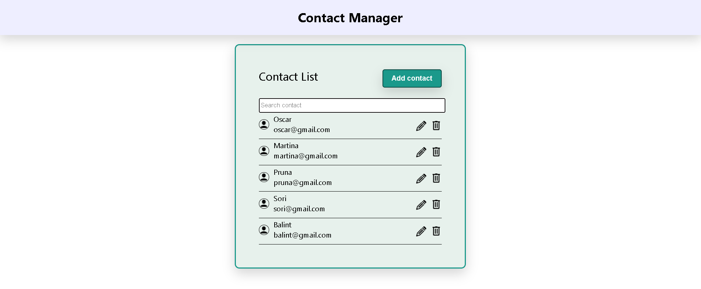
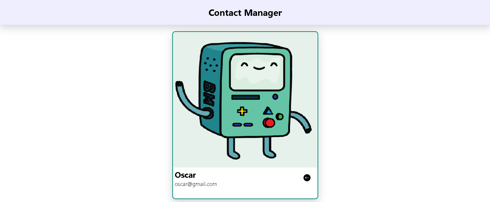
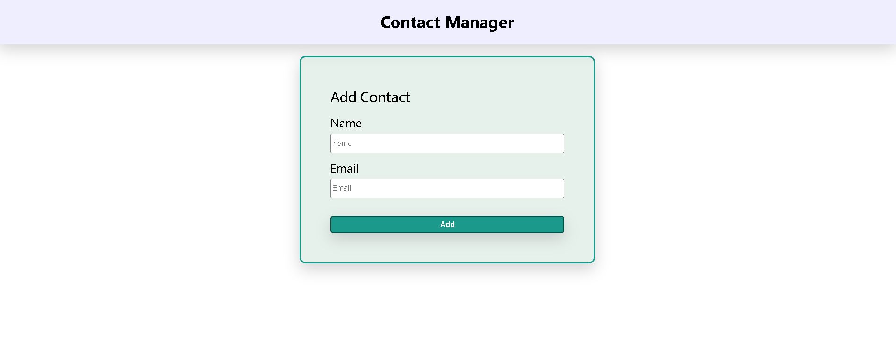
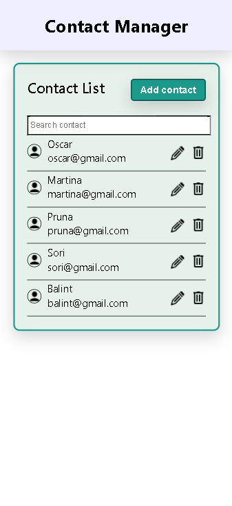
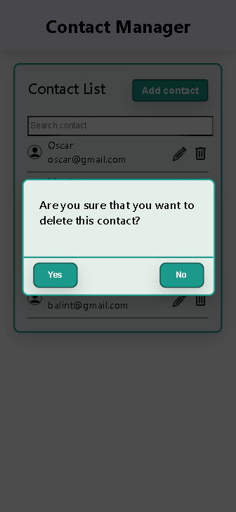

# Web application for contacts

The project represents an application for storing contacts by name and e-mail. You can add, edit and delete a contact as well as searching through contacts.

The technologies used for this project are React, HTML, CSS, Javascript(Frontend), [JSON server](https://github.com/typicode/json-server) as an API(Backend).

In order to start the application, write the following commands in the Terminal:
```bash
npm install
npm start
```

For the JSON Server, firstly install it by writing in the terminal :
```bash 
npm install -g json-server
```
And then start it by using:
```bash
npm start
```





And also there is the mobile version for it: 





